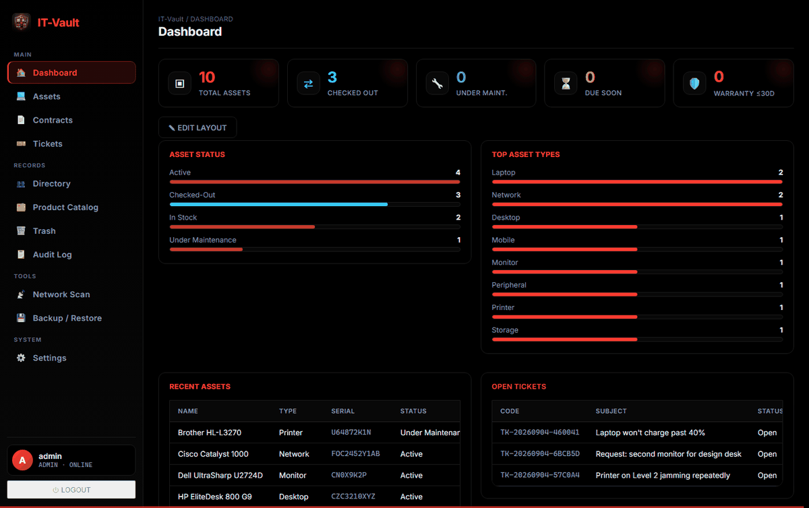
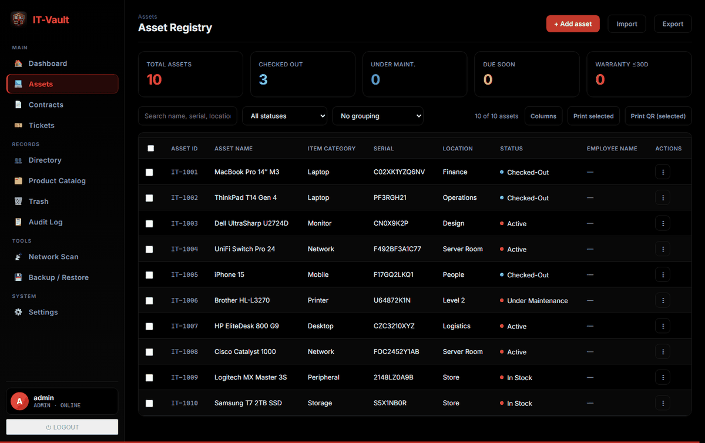
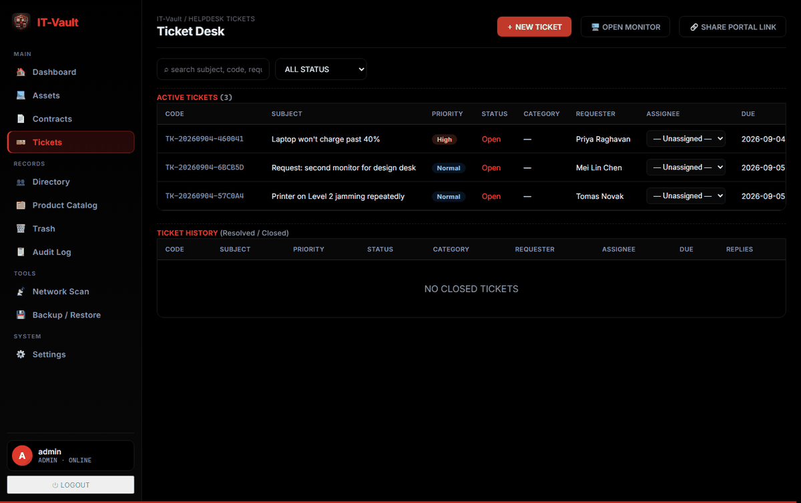
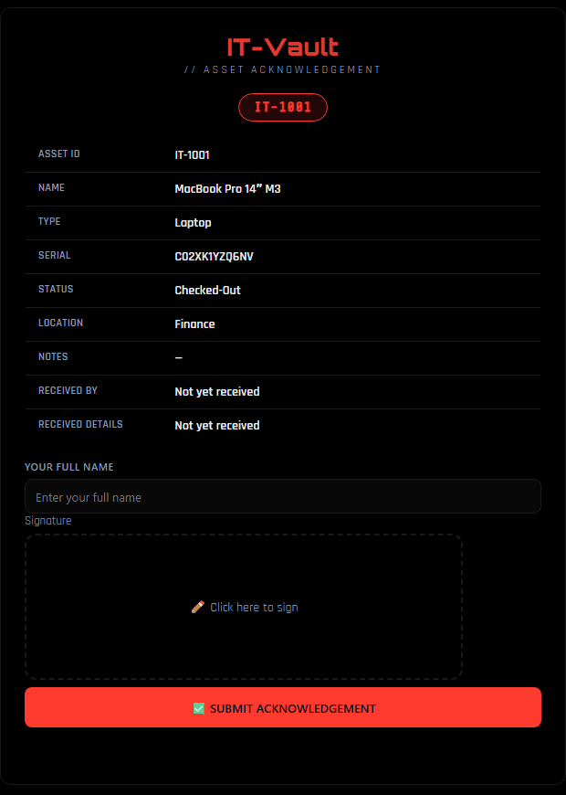

# IT-Vault

[](LICENSE)
[](https://github.com/shatheitguy/it-vault/pkgs/container/it-vault)
[](https://shatheitguy.github.io/it-vault/)
[](https://github.com/shatheitguy/it-vault/releases/latest/download/IT-Vault.apk)

A self-hosted IT asset & helpdesk manager: track assets, employees, checkouts,
maintenance history, support tickets (with a public portal + a live wallboard
monitor), audit logging, LDAP/AD sync, network scanning, and full theming —
built as a Flask backend with a single-file vanilla-JS frontend and MariaDB
for storage.

## Android app

A native Android companion app — assets, tickets, contracts and the directory on
your phone, with **offline-first editing** that syncs when you're back online, QR /
barcode scanning, and **built-in updates** (the app checks for new versions itself,
no store required). It also picks up your server's own name and logo after login,
so it wears your branding rather than the defaults.

**[⬇ Download IT-Vault.apk](https://github.com/shatheitguy/it-vault/releases/latest/download/IT-Vault.apk)**

Android will warn that the app is from an unknown developer — that's expected for
any app installed outside the Play Store. Tap **More details → Install anyway**.
Once installed, the app updates itself from **Settings → Check for updates**.

## Screenshots



| The register | Tickets |
|---|---|
| [](docs/img/assets.png) | [](docs/img/tickets.png) |

<table>
<tr>
<td width="45%"></td>
<td>

**What the employee gets.** Assign an asset and they receive one button by
email — no account, no login. The link opens this page on their phone: they
check the details, type their name, sign with a finger. On submit a signed
PDF goes to them *and* to every admin with an address on file, the asset
flips to `Checked-Out`, and the signature stays attached to it.

</td>
</tr>
</table>

*A factory-new install — the theme, layout and branding above are what you
get on first run. Every asset, name and serial is invented.*

## Install IT-Vault and a database, in one step

On a Linux server (or macOS) this is the whole thing. The Windows
installer doesn't set up a database yet -- there, IT-Vault starts on its
own and the browser wizard asks for a MariaDB/MySQL you point it at:

```bash
curl -fsSL https://raw.githubusercontent.com/shatheitguy/it-vault/main/install.sh | sh
```

It asks whether to install MariaDB alongside IT-Vault, then asks for three
things and does the rest:

```
Database

  IT-Vault needs MariaDB or MySQL. It can install one here as a container
  and wire itself up, or you can point it at a server you already run.

Install MariaDB here and connect IT-Vault to it? [y/N] y

  Database name     [itvault]: itvault
  Database username [itvault]: itvault
  Database password [Enter = generate one]:
  confirm:

    database  itvault
    username  itvault
    password  set
```

From those answers it creates the `itvault-net` network and the `itvault_db`
volume, starts MariaDB on that network, waits for it to finish initialising,
and starts IT-Vault already connected with the credentials in place — so
there is no setup wizard to fill in, no `CREATE USER`, no `GRANT`, and none
of the `1045 Access denied` that a missed step produces. Press Enter at the
password prompt and it generates a strong one; MariaDB's own `root` password
is always generated separately and is never the one the application uses.

Open **http://localhost:5000** and create the admin account. That's it.

Say **no** to the database question and IT-Vault starts on its own, with the
first-run wizard in the browser asking for a MariaDB/MySQL you already run.
Either way the database is yours — IT-Vault never upgrades or deletes it, so
your version, backups and retention policy stay your decision.

To skip the questions entirely — for a scripted or unattended install:

```bash
curl -fsSL https://raw.githubusercontent.com/shatheitguy/it-vault/main/install.sh | sh -s -- \
  --db-name itvault --db-user itvault --db-pass 'choose-something-long'
```

Or `--with-db --yes` to accept every default with a generated password, and
`--no-db` to skip the question and use the browser wizard.

### What it creates

Nothing hidden — the same four objects you would create by hand:

| | |
|---|---|
| network `itvault-net` | lets IT-Vault reach the database by container name, so port 3306 is never published to your LAN |
| volume `itvault_db` | MariaDB's data directory |
| container `itvault-db` | `mariadb:11`, on that network, with a healthcheck |
| container `itvault` | IT-Vault, on that network, with `DB_HOST=itvault-db` already set |

`--dry-run` prints all of it and changes nothing, on a machine with no Docker
at all:

```bash
curl -fsSLO https://raw.githubusercontent.com/shatheitguy/it-vault/main/install.sh
less install.sh && sh install.sh --dry-run
```

## Install in one line

```bash
curl -fsSL https://raw.githubusercontent.com/shatheitguy/it-vault/main/install.sh | sh
```

Windows PowerShell:

```powershell
irm https://raw.githubusercontent.com/shatheitguy/it-vault/main/install.ps1 | iex
```

From `cmd.exe`, wrap it — `irm` and `iex` are PowerShell, not cmd:

```
powershell -NoProfile -c "irm https://raw.githubusercontent.com/shatheitguy/it-vault/main/install.ps1 | iex"
```

That pulls the image, creates the volumes, starts IT-Vault on
**http://localhost:5000** and waits until it actually answers before telling
you it worked. **No Docker? It offers to install it** — Docker's own script on
Linux, Homebrew on macOS, winget on Windows — and waits for the engine to come
up before carrying on. It asks first unless you pass `--yes`.

**Don't want Docker?** Say no when it offers to install it and it will offer to
install IT-Vault directly on the machine instead (Python + waitress in a
virtualenv) -- or skip straight there with `--no-docker`. You bring your own
database either way.

It offers to install **MariaDB** too — see
[Install IT-Vault and a database, in one step](#install-it-vault-and-a-database-in-one-step)
above. Decline and the database stays yours to point at, and the installer
finishes by printing the MariaDB one-liner if you haven't got one. An existing
IT-Vault container is started if stopped, and otherwise left alone — it owns
your data volumes.

Options, as environment variables or flags:

| | |
|---|---|
| `--port 8080` / `$env:ITVAULT_PORT` | host port, default 5000 |
| `--tag 1.7.0` / `$env:ITVAULT_TAG` | image tag, default `latest` |
| `--name myvault` / `$env:ITVAULT_NAME` | container name, default `itvault` |
| `--yes` / `$env:ITVAULT_YES` | don't ask before installing Docker |
| `--dry-run` / `$env:ITVAULT_DRY` | print the plan, change nothing |
| `--with-db` / `$env:ITVAULT_WITH_DB` | install MariaDB without being asked, wire it up and skip the setup wizard *(install.sh only)* |
| `--no-db` / `$env:ITVAULT_NO_DB` | don't ask about MariaDB; use the browser wizard *(install.sh only)* |
| `--db-name` / `--db-user` / `--db-pass` | answer the database questions up front, implies `--with-db` *(install.sh only)* |
| `--no-docker` / `$env:ITVAULT_NO_DOCKER` | skip Docker and install IT-Vault straight on the host (Python + waitress) |
| `--dir` / `$env:ITVAULT_DIR` | where a no-Docker install lands, default `~/it-vault` |

Piping a script from the internet into a shell is worth being fussy about.
To read it first:

```bash
curl -fsSLO https://raw.githubusercontent.com/shatheitguy/it-vault/main/install.sh
less install.sh && sh install.sh --dry-run && sh install.sh
```

`--dry-run` works on a machine with no Docker at all, so you can see exactly
what would happen before anything does.

### Uninstalling

```bash
curl -fsSL https://raw.githubusercontent.com/shatheitguy/it-vault/main/uninstall.sh | sh
```

```powershell
irm https://raw.githubusercontent.com/shatheitguy/it-vault/main/uninstall.ps1 | iex
```

It lists what it found, asks once, then removes the container and the image.
**Your data is not touched by default** — the volumes and your database
survive, so reinstalling picks up where you left off. It prints exactly what
it kept and the command to remove each thing later.

To go further:

| | |
|---|---|
| `--purge` / `$env:ITVAULT_PURGE` | also delete the volumes: invoices, backups, session key. Permanent. |
| `--purge-db` / `$env:ITVAULT_PURGE_DB` | also delete the `itvault-db` container and its volume, if you created one from this project's suggested command. That is your whole database. |
| `--dry-run` / `$env:ITVAULT_DRY` | print the plan, change nothing |

Docker itself is never removed — use your package manager or Docker Desktop's
own uninstaller.

Prefer to do it yourself? The rest of this README is the manual route.

## Signed handovers, without the paperwork

Handing someone a laptop is normally a form, a signature, a scan, and a folder
nobody can find a year later. IT-Vault does it in one email:

1. **Assign the asset** to an employee.
2. **They get an email with a single button** — no account, no login, nothing
   to install.
3. **They sign on their phone**: the link opens the asset's details, they type
   their name and sign with a finger.
4. **Copies go out by themselves.** A signed PDF is emailed to the employee
   *and* to every admin account with an address on file.
5. **It's on the record.** The asset flips to `Checked-Out`, and the
   signature, signer name and date stay attached to it — viewable and
   printable later.

The sign page only claims "sent to your inbox" when a copy really went, which
needs SMTP configured under Settings → Notifications and an email address on
the employee's record.

Other things that run without being asked:

| | |
|---|---|
| Contract expiry alerts | renewal dates watched on a schedule and emailed before they lapse |
| Scheduled backups | archives on a timer, by scope, on their own volume |
| LDAP / AD sync | your directory pulled in on a schedule rather than by hand |
| Warranty watch | anything inside 30 days surfaces on the dashboard on its own |
| Update checks | the app spots a new release and installs it in one click |
| Audit trail | every change recorded with who and when, with no opt-in |

## Step 1 — get a database

IT-Vault ships without one, so it never dictates your database's version,
backups or retention. Any MariaDB 10.6+ (or MySQL 8+) works. Pick whichever
of these suits you.

### Option A — MariaDB as a Docker container

Quickest if you already run Docker:

```bash
docker volume create itvault_db

docker run -d --name itvault-db --restart unless-stopped \
  -e MARIADB_ROOT_PASSWORD='<a-strong-root-password>' \
  -e MARIADB_DATABASE=itvault \
  -e MARIADB_USER=itvault \
  -e MARIADB_PASSWORD='<a-strong-password>' \
  -v itvault_db:/var/lib/mysql \
  mariadb:11
```

That creates the database and user for you, so you can skip the SQL below.
Keep the volume — it *is* your data. Don't publish port 3306 unless you
genuinely need outside access; IT-Vault reaches it over the Docker network.

To let the two containers talk, put them on one network:

```bash
docker network create itvault-net
docker network connect itvault-net itvault-db
```

…then attach IT-Vault to `itvault-net` too, and use **`itvault-db`** as the
database host.

### Option B — MariaDB on a server or your own machine

Better if you already run a database server, or want it outside Docker.

```bash
# Debian / Ubuntu
sudo apt install mariadb-server

# RHEL / Rocky / Fedora
sudo dnf install mariadb-server && sudo systemctl enable --now mariadb

# macOS
brew install mariadb && brew services start mariadb
```

On Windows, use the installer from [mariadb.org/download](https://mariadb.org/download/)
and **let it install as a service** so it starts at boot — otherwise it dies
with the session that started it.

Then run `sudo mariadb-secure-installation` (set a root password, remove the
anonymous users) and create the database:

```sql
CREATE DATABASE itvault CHARACTER SET utf8mb4;
CREATE USER 'itvault'@'%' IDENTIFIED BY '<a-strong-password>';
GRANT ALL PRIVILEGES ON itvault.* TO 'itvault'@'%';
FLUSH PRIVILEGES;
```

Restrict the host if you can: `'itvault'@'localhost'` for a database on the
same machine, or `'itvault'@'172.17.%'` for the Docker bridge, instead of
`'%'` which allows connections from anywhere.

### Which host does IT-Vault use?

This is the one thing people get wrong. From inside the IT-Vault container,
`127.0.0.1` means *the container itself*, not your machine:

| Where the database runs | `DB_HOST` |
|---|---|
| Docker container on the same network | that container's name, e.g. `itvault-db` |
| Same machine, outside Docker | `host.docker.internal` |
| Another server | its hostname or IP |
| IT-Vault also running outside Docker | `127.0.0.1` |

## Step 2 — run IT-Vault

```bash
git clone https://github.com/shatheitguy/it-vault.git
cd it-vault
cp .env.example .env    # optional: fill in the DB_* values
docker compose up -d
```

Open **http://localhost:5000**. A fresh install lands on the first-run setup
wizard: enter your database connection (it's tested before anything is
saved), then create your own administrator account. There is no default
password to change afterwards — nothing can sign in until you make that
account. The schema builds itself, and migrates itself on upgrade.

## Running the published image directly

Every release publishes to GitHub Container Registry, so you don't need a
source checkout at all:

```bash
docker run -d --name itvault -p 5000:5000 \
  -v itvault_data:/app/data \
  -v invoices_data:/app/invoices \
  -v backups_data:/app/backups \
  -e ITVAULT_DATA_DIR=/app/data \
  ghcr.io/shatheitguy/it-vault:latest
```

Then open the setup wizard and enter your database details. `latest` follows
`main`, so a pull always brings down the current build; pin a version tag
instead if you want to stay on a fixed one.

Keep `/app/data` on a volume: it holds the generated session-signing key and
the saved database pointer, so an image update doesn't sign everyone out.

## Updating

**Settings → General → Check for Updates** compares your running version
against the latest published release. When there's a newer one, the panel
shows what's available, a link to the release notes, and an **UPDATE NOW**
button.

On a source checkout, that button works out of the box: it pulls the new
code, installs any new requirements and restarts, then the page reloads
itself into the new version.

Containers need one extra piece — see below. Until it's set up, the same
panel gives you the command to run yourself, with a one-click copy:

```bash
docker compose pull && docker compose up -d
```

Either way your database is untouched (it isn't ours to touch), invoices,
backups and the session key live on volumes that survive the swap, and the
schema migrates itself on start.

### Updating a plain `docker run` install

Without compose, one thing first: **`docker restart` does not update
anything.** Restarting reuses the image the container was created from, so it
comes back on exactly the version it was already running. Updating means
pulling the new image and recreating the container:

```bash
docker pull ghcr.io/shatheitguy/it-vault:latest

docker rm -f itvault
docker run -d --name itvault --restart unless-stopped \
  -p 5000:5000 \
  -e ITVAULT_DATA_DIR=/app/data \
  -v itvault_data:/app/data \
  -v invoices_data:/app/invoices \
  -v backups_data:/app/backups \
  ghcr.io/shatheitguy/it-vault:latest
```

Removing the *container* is safe. Removing its *volumes* is not:
`itvault_data` holds the saved database pointer and the generated session key,
so keep all three `-v` flags exactly as they were, or you will come back to
the setup wizard with everyone signed out.

Add back any other flags your install uses — `--network`, a different
`--port`, `ITVAULT_WATCHTOWER_TOKEN`. If you can't remember them, read them
off the running container before you remove it:

```bash
docker inspect itvault --format '{{range .Config.Env}}{{println .}}{{end}}'
```

Then check the new version is actually live:

```bash
docker exec itvault cat VERSION
```

### One-click and automatic updates for containers

IT-Vault deliberately cannot replace its own container. Doing that from the
inside means mounting the host's Docker socket into the app — root-equivalent
control of the machine, handed to the process that also handles uploads, LDAP
and SMTP. So instead it asks [Watchtower](https://containrrr.dev/watchtower/)
to do it: the socket stays with a small single-purpose container, and
IT-Vault just sends it a request.

Pick a long random token, put it in `.env`:

```
ITVAULT_WATCHTOWER_TOKEN=<a-long-random-string>
```

uncomment the `watchtower` service at the bottom of `docker-compose.yml`,
and bring it up:

```bash
docker compose up -d
```

**UPDATE NOW** now works, and Watchtower also checks once a day on its own,
so releases land even if nobody opens Settings. Drop the `--interval` from
its `command` to only ever update when you click.

Running the image without compose? Same idea:

```bash
docker run -d --name watchtower --restart unless-stopped \
  -v /var/run/docker.sock:/var/run/docker.sock \
  -e WATCHTOWER_HTTP_API_UPDATE=true \
  -e WATCHTOWER_HTTP_API_TOKEN=<the-same-token> \
  containrrr/watchtower --cleanup --interval 86400 itvault
```

…then start IT-Vault with `-e ITVAULT_WATCHTOWER_TOKEN=<the-same-token>` on
the same Docker network.

That last part matters: `ITVAULT_WATCHTOWER_URL` defaults to
`http://watchtower:8080`, and that name only resolves on a user-defined Docker
network, so both containers have to share one. If IT-Vault runs with
`--network host` — which the network scanner needs in order to see your LAN —
the name won't resolve at all. Publish Watchtower's port with `-p 8080:8080`
and point IT-Vault at it instead:

```
ITVAULT_WATCHTOWER_URL=http://127.0.0.1:8080
```

If you'd rather stay deliberate about upgrades, skip Watchtower entirely:
pin a version in `.env` (`ITVAULT_TAG=1.6.1`) and bump it when you choose.

## Configuration

Everything is optional (see `.env.example`). `DB_HOST` / `DB_PORT` /
`DB_NAME` / `DB_USER` / `DB_PASS` set the database connection, but you can
leave them blank and enter it in the setup wizard instead — either way it's
saved to `/app/data` and reconfigurable later in Settings → Database.

`ITVAULT_ADMIN` / `ITVAULT_ADMIN_PASS` create the first admin without the
wizard, for unattended installs; unset, the wizard asks. `ITVAULT_SECRET`
overrides the session-signing key, which is otherwise generated and kept in
`/app/data` — leave it unset unless you're running several replicas that
must share one key.

Runtime settings that change *inside* the app — branding, theme colors,
SMTP, LDAP, ticket SLAs, roles — live in the database via Settings → \* in
the UI, not in environment variables.

### If branding won't save, or the database pointer keeps resetting

Symptoms: uploading a letterhead returns `Permission denied`, an uploaded
logo never appears, or the setup wizard asks for the database again after
every update.

All three are the same cause. Docker seeds a *new* named volume from the
directory it shadows — ownership included — but if that directory isn't in
the image it creates the volume empty and owned by `root`. IT-Vault runs as
uid 1000, so nothing can be written into `/app/data`. Images from this commit
onward ship the directory, so new installs are fine; a volume created by an
older image keeps its root ownership and needs fixing once:

```bash
docker run --rm -v itvault_data:/data alpine chown -R 1000:1000 /data
```

Then restart IT-Vault. Nothing is lost either way — branding and settings are
stored in the database, and `/app/data` is only a cache for them — but the
session key and the saved database pointer do need a writable volume. The
startup log prints this same command if the directory isn't writable.

## Database

- **You own it.** IT-Vault connects to whatever MariaDB/MySQL you give it —
  bare metal, another container, or a managed instance. It never provisions,
  upgrades or deletes the server, so your backup and retention policy stays
  yours. Change where it points any time in Settings → Database, or via the
  `DB_*` variables.
- **Schema**: created on first start and migrated on every start, so an
  upgrade needs no manual SQL.
- **Backups**: Settings → Backup / Restore exports and restores archives by
  scope (everything, config only, or assets only). An "everything" archive
  includes the uploaded logo and letterhead, which are stored in the database
  (with a copy on disk as a cache). Restoring clears each table before
  repopulating it, so it reverts to that point in time rather than merging.
- **What's on volumes**: `/app/data` (session key, saved DB pointer, and a
  cache of the uploaded branding),
  `/app/invoices` (uploaded invoices) and `/app/backups` (generated
  archives). These survive `docker compose down`; only `down -v` destroys
  them. Your database lives wherever you installed it and is untouched by
  any of that.

## Development (without Docker)

```bash
pip install -r requirements.txt
python serve.py   # expects a MariaDB reachable via the DB_* env vars
```

## License

**GNU Affero General Public License v3.0 or later** — see [LICENSE](LICENSE).

In plain terms: run it, anywhere, for anything, including commercially, for
free. Modify it all you like. The one condition is reciprocity — if you
modify IT-Vault and let other people use it, whether you ship them a copy
**or just host it for them over a network**, you have to make your modified
source available to them under the same licence.

That last part is the difference between the AGPL and the ordinary GPL, and
it's deliberate: IT-Vault is a web app, so "hosting it" is how it's used.

Copyright (C) 2026 Sharqan Ahamed (Sha The IT Guy)

## Author

**Sharqan Ahamed** — *Sha The IT Guy*

- 🌐 Website: [shatheitguy.in](https://shatheitguy.in)
- 💻 More projects: [github.com/shatheitguy](https://github.com/shatheitguy)

Built and maintained with 💻 and ☕. If IT-Vault is useful to you, a ⭐ on the
repo is appreciated.
